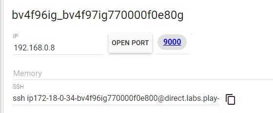
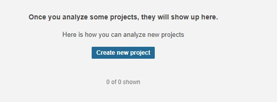
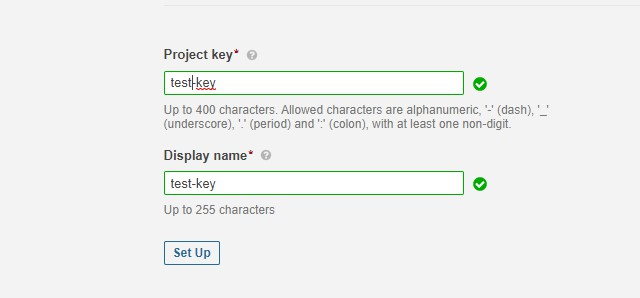
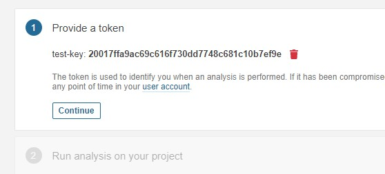
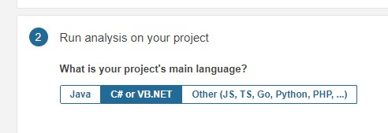

## 🔥 Configurando Sonarquebe en 7 minutos 🔥 
- - -

#### **[01]  Crear servicio de Sonarqube**
Ingresar a `https://labs.play-with-docker.com` y crear una nueva instancia

Dentro del contenedor vamos a correr el servicio de sonarqube con el siguiente commando:
> docker run -d --name sonarqube -e SONAR_ES_BOOTSTRAP_CHECKS_DISABLE=true -p 9000:9000 sonarqube:latest

La herramienta va a asociarnos el servicio y exponerlo en el puerto indicado, podemos ingresar al servicio cliqueando el puerto:

Vamos a hacer un login dentro de sonar:
> user: admin
> pass: admin

 
#### **[02]  Crear un proyecto en Sonar**
- Crear un nuevo proyecto, 

- Proveer crear una key asociada a ese proyecto

- Crear un token de acceso al proyecto 

- Elegir qué lenguaje será analizado en el proyecto

 
#### **[03] Añadiendo Sonarqube en nuestro proyecto**
**Requisito**: *En nuetra máquina vamos a necesitar tener instalado el sdk de java..*
Vamos a necesitar también la herramienta de build de sonarqube del framework que vayamos a utilizar, en éste caso vamos a analizar un proyecto en C# con NetCore, 
En nuestra máquina vamos a instalar: 
> dotnet tool install --global dotnet-sonarscanner --version 4.8.0

 
#### **[04] Build de nuestro proyecto**
Vamos a abrir una consola en la solución de nuestro proyecto vamos a correr los siguientes comandos

> dotnet sonarscanner begin /k:"<project_key>" /d:sonar.host.url="<sonar_container_url>" /d:sonar.login="<sonar_project_token_id>"

> dotnet build

> dotnet sonarscanner end /d:sonar.login="<sonar_project_token_id>"

 
**[05] Verificar**
Volvemos a la página sonarqube y podemos analizar la calidad de nuestro código
    ...Que comience el juego
